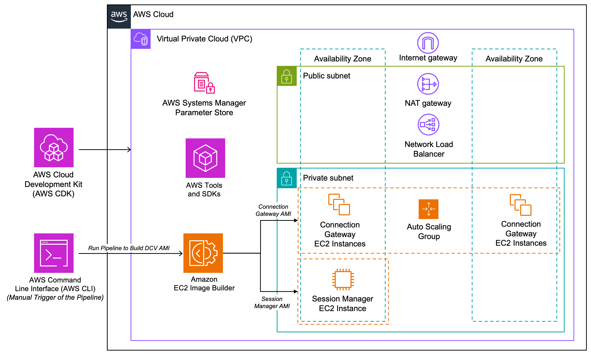
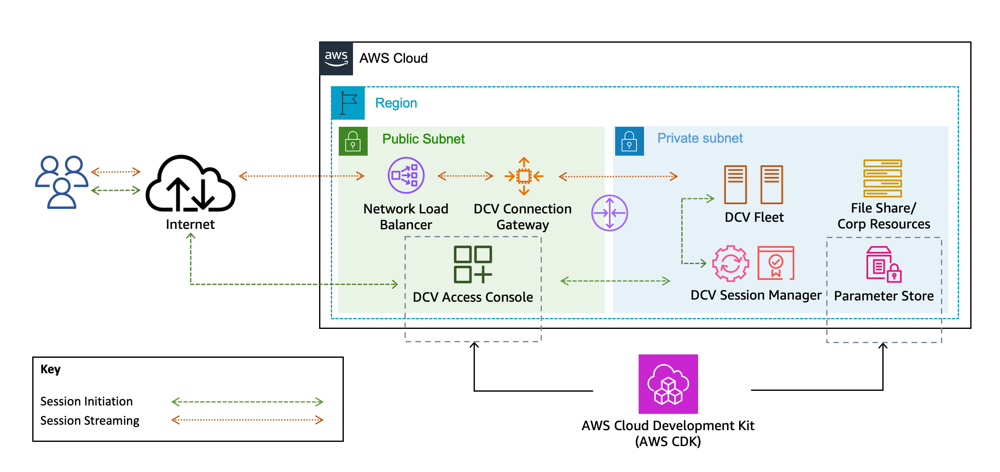

# DCV CDK Samples

This folder contains sample DCV deployments using the [AWS Cloud Development Kit](https://aws.amazon.com/cdk/) (AWS CDK). These samples are intended to be used so you quickly deploy a DCV environment. The code samples may be modified to meet you requirements. 

## Glossary 
- [dcv-gw-sm-without-pipelines](./dcv-gw-sm-without-pipelines/README.md)
- [dcv-gw-sm-with-pipelines](./dcv-gw-sm-with-pipelines/README.md)
- [dcv-sm-access-console](./dcv-access-console/README.md)

## Overview

### dcv-gw-sm-without-pipelines 
This AWS CDK sample provisions the foundational infrastructure for a [DCV Connection Gateway](https://docs.aws.amazon.com/dcv/latest/gw-admin/what-is-gw.html) with [DCV Session Manager](https://docs.aws.amazon.com/dcv/latest/sm-admin/what-is-sm.html) environment. Both DCV Session Manager and DCV Connection Gateway are configured with bootstrap scripts so that can you utilize base AMIs. This deployment is intended to be deployed with Amazon Linux 2, but you can also deploy using other supported operating systems. 

### dcv-gw-sm-with-pipelines
This AWS CDK sample provisions the foundational infrastructure for a [DCV Connection Gateway](https://docs.aws.amazon.com/dcv/latest/gw-admin/what-is-gw.html) with [DCV Session Manager](https://docs.aws.amazon.com/dcv/latest/sm-admin/what-is-sm.html) environment. Both DCV Session Manager and DCV Connection Gateway have EC2 Image Builder pipelines to publish a configured AMI. This deployment is intended to be deployed with ARM-based Amazon Linux 2, but you can also deploy using other supported operating systems. 

 

### dcv-access-console
This AWS CDK sample provisions a single Amazon EC2 instance that hosts all of the [DCV Access Console](https://docs.aws.amazon.com/dcv/latest/access-console/what-is-access-console.html) components. This deployment depends on an existing DCV Session Manager environment. If you do not have an existing environment, you may deploy *dcv-gw-sm-without-pipelines* or *dcv-gw-sm-with-pipelines* before deploying *dcv-access-console*. This CDK is intended to be deployed with ARM-based Amazon Linux 2023, but you can also deploy using other supported operating systems. The usage of a DCV Connection Gateway is optional. The CDK also supports the DCV Access Console being deployed in a private subnet to be accessed internally. 

 

## Security

See [CONTRIBUTING](CONTRIBUTING.md#security-issue-notifications) for more information.

## License

This library is licensed under the MIT-0 License. See the LICENSE file.
