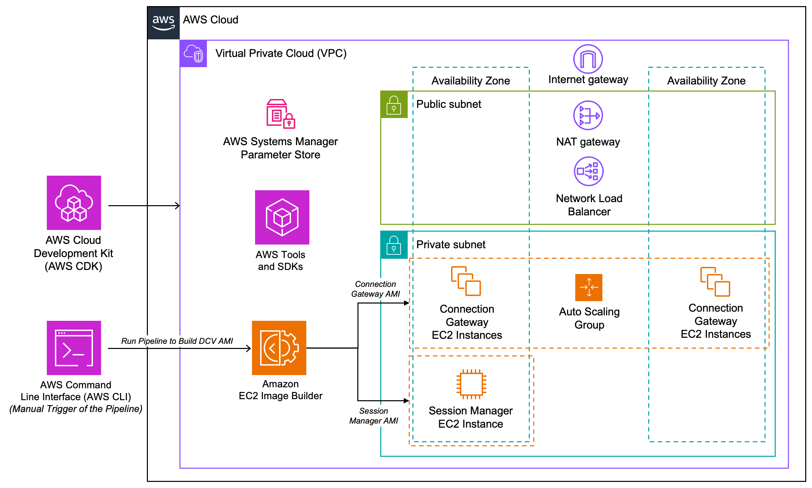
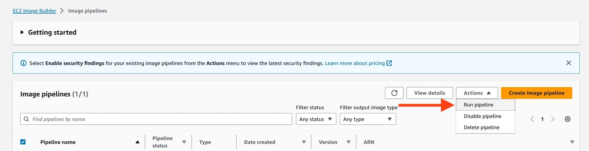

# Scale Out Deployment of NICE DCV Connection Gateway, Sessions Manager, and Broker

Accelerate cloud deployment of foundational autoscaling infrastructure for [NICE DCV](https://aws.amazon.com/hpc/dcv/) with AWS Cloud Development Kit (AWS CDK). AWS CDK will create EC2 Image builder pipelines to create images to run DCV components on Amazon Elastic Compute Cloud (Amazon EC2).

## Overview
The architecture diagram below depicts the resources that this solution will deploy into your account.
>Note: A DCV fleet will need to be spun up in conjunction with this solution. For testing this solution, one will be created near the end of the procedure below.

 
Figure 1: AWS CDK that will setup the image build process and foundational infrastructure for a scale out solution of NICE DCV Connection Gateway and Session Manager.

## Prerequisites
- An AWS account with full permissions on:
    - Amazon EC2 Image Builder
    - AWS Systems Manager (AWS SSM) Parameter Store
    - AWS SSM Session Manager
    - Amazon Elastic Compute Cloud (Amazon EC2) 
    - Amazon Virtual Private Cloud (Amazon VPC)
- A system with the following installed:
    - AWS CLI 
    - AWS CDK 
    - Node.js
    - Python
    - Git
- Basic understanding of:
    - Image building 
    - AWS Cloud 
    - Scripting languages (Python, Bash)
    - DCV
 
>Note: See Testing Prerequisites for additional items

# EC2 Image Builder Pipeline
This example will create:
- Two EC2 Image Builder Pipelines to build the DCV images; one for DCV Session Manager and one for DCV Connection Gateway

There are two image builder pipelines that will be created:
- Session Manager
- Connection Gateway

>Note: If you do not provide a target VPC, a default VPC is required for the EC2 Image Builder Pipeline. If your environment doesn't have a default VPC, you will receive an error message similar to "...An error occurred (VPCIdNotSpecified) when calling the RunInstances operation: No default VPC for this user..." when invoking the pipeline. 

# AWS VPC Infrastructure Creation with CDK
This example contains:
- Choice of VPC and Subnets
    - If you do not specify a VPC, the CDK will create:
        - A new VPC with an Internet Gateway
        - Public and Private subnets
        - Two availability zones
        - NAT Gateway
- A security groups for DCV Connection Gateway, DCV Session Manager, and DCV Server
- IAM roles required for configuration
- Network Load Balancer for DCV Connection Gateway
- Autoscaling Groups for the DCV Connection Gateway instances
    - This solution will initialize the autoscaling group with one Connection Gateway instance per availability zone
    - Autoscaling based off of CPU consumption
- SSM Parameter Store parameter to hold the broker DNS 

>Note: An SSH key-pair (.pem or .ppk) is required to be registered in your AWS account and region. This key-pair name is required within the `config.json` file before deploying the infrastructure stack in order to allow SSH access into the instances. AWS SSM can also be used for terminal access.

## Step 1: NPM 
The LTS version of [npm](https://www.npmjs.com/) is recommended. If npm is already on your system, upgrade npm to the latest version.
npm install -g npm@latest

```bash
npm install -g npm@latest
```

## Step 2: AWS CDK 

Ensure that the latest [aws-cdk](https://aws.amazon.com/cdk/) is installed. 

```bash
npm install -g aws-cdk
```

Once installed, the command cdk --version will confirm installation was successful.

```bash
cdk --version
```

## Step 3: AWS CLI 
Install [AWS CLI](https://docs.aws.amazon.com/cli/latest/userguide/getting-started-install.html)


## Step 4: Git
Install [Git](https://git-scm.com/)

## Step 5: Clone the Repository
Visit [clone a repository](https://docs.github.com/en/repositories/creating-and-managing-repositories/cloning-a-repository) for instructions. Clone this repository locally. 

## Step 6: Create a virtual environment
Open up a command line terminal of your choice. Change directory into the cloned repository. 
### Windows
```bash
virtualenv --python <PATH-TO-PYTHON-VERSION-EXE> dcv-env
.\dcv-env\Scripts\activate
```
### macOS/Linux
```bash
virtualenv --python <PATH-TO-PYTHON-VERSION-BINARY> dcv-env
source dcv-env/bin/activate
```

## Step 7: Install Project Dependencies
Install project dependencies by running the following command.

```bash
pip install -r requirements.txt
```

## Step 8: Assume IAM role 
[Use an IAM role in the AWS CLI](https://docs.aws.amazon.com/cli/latest/userguide/cli-configure-role.html). 
> Note: To confirm your credentials are associated with the correct AWS account, you can run the following AWS CLI command - 
```bash
aws sts get-caller-identity 
```
(See [get-caller-identity](https://awscli.amazonaws.com/v2/documentation/api/latest/reference/sts/get-caller-identity.html) in the AWS CLI documentation). 

## Step 9: CDK Bootstrap
[Bootstrap your AWS CDK environment. ](https://docs.aws.amazon.com/cdk/v2/guide/cli.html#cli-bootstrap)
Replace with your desired account number and region.
```bash 
cdk bootstrap 1234567890/us-east-1
```

> Note: sess_manager_ami and conn_gateway_ami will need to get updated with AMI IDs after deploying SessionMgrAmiStack and ConnectionGwyAmiStack stacks and running their pipelines.

## Step 10: Set AWS Account and Region for Infrastructure
Set the AWS account id and region by specifying in `config.json` 
```bash
{
    ...
    "accountId": "xxxxxxxxxxxx",
    "region": "xxxxxxxxxxxxxxx",
    ...
}
```
Also, be sure the region is set in your AWS credentials by running the following command by replacing `us-east-1` with  your intended region:

For Windows:
```powershell
set AWS_REGION=us-east-1
```
For Mac/Linux:
```bash
export AWS_REGION=us-east-1
```

## Step 11: Check Project with Synth
Verify there are no errors with the cloned project with [cdk synth](https://docs.aws.amazon.com/cdk/v2/guide/cli.html#cli-synth) (synthesize). 
```bash
cdk synth --all
```

## Step 12: Deploy Session Manager stack
The CDK will create the DCV Sessions Manager EC2 Image Builder Pipeline.
```bash
cdk deploy SessionMgrAmiStack
```

## Step 13: Deploy Connection Gateway stack
The CDK will create the DCV Connection Gateway EC2 Image Builder Pipeline.
```bash
cdk deploy ConnectionGwyAmiStack
```

## Step 14: Run the EC2 Builder Pipelines
Run pipelines to create the AMIs for the Sessions Manager and the Connection Gateway.


### Option 1: Running Pipeline from AWS CLI

Run the following command to run the pipeline. Replace the `<region>`, `<account number>`, and `<pipeline name>` with your values. The pipeline names are `dcv-connection-gwy-ami-pipeline` or `dcv-session-mgr-ami-pipeline`.

```bash
aws imagebuilder start-image-pipeline-execution \
--image-pipeline-arn arn:aws:imagebuilder:<region>:<account number>:image-pipeline/<pipelinename>
```
<br>

The cdk outputs the values to run the pipeline using the AWS CLI. 

- Run the dcv-sess-mgr pipeline first
- If successful, run the dcv-conn-gateway pipeline
- Take note of the AMI IDs created

**Example:** Using the AWS CLI to run the image pipeline.
```bash
aws imagebuilder start-image-pipeline-execution --image-pipeline-arn arn:aws:imagebuilder:<region>:<account>:image-pipeline/pipeline-dcv-conn-gateway  

```

**Example:** Using the AWS CLI to get the AMI ID from the pipeline build. 

```bash 
aws imagebuilder list-image-build-versions --image-version-arn arn:aws:imagebuilder:<region>:<account>:image/recipe-dcv-sess-mgr/1.0.0 | grep ami- 
                       
```

Example sample output
```bash
 "image": "ami-1234567890abcdef0",
```
The AMI ID response value will be added in the config.json file in Step 14.

### Option 2: Use the **Run pipeline** action in the AWS Management Console.

For more information, see *Run your image pipeline* in the [EC2 Image Builder User Guide](https://docs.aws.amazon.com/imagebuilder/latest/userguide/pipelines-run.html).

 

 - Run the dcv-sess-mgr pipeline first
 - If successful, run the dcv-conn-gateway pipeline
 - Take note of the AMI IDs created
 

## Step 15: Add AMI IDs into the CDK project

Locate and note the AMI ID for each of your pipelines. Your images can be found on the *Images* page in the [EC2 Image Builder Console](https://console.aws.amazon.com/imagebuilder/home?#/images). For more information, see the *List images and build versions* section of the [EC2 Image Builder User Guide](https://docs.aws.amazon.com/imagebuilder/latest/userguide/image-details-list.html).

Update `config.json` with the AMI IDs from each of your pipelines. Update sess_manager_ami and conn_gateway_ami values. 

Example config.json

```bash
{
	"accountId": "xxxxxxxxxxxx",
    ...
    "connectionGwy" : {
        ...
        "builderAmiId": "ami-xxxxxxxxxxxxxxxxx"
}
```

## Step 16: Key Pairs for EC2
Use your own Key Pair or [Create Key Pairs](https://docs.aws.amazon.com/AWSEC2/latest/UserGuide/create-key-pairs.html) for accessing the EC2s.

Use the Key Pair value for ssh_keypair_name in `config.json` 
```bash
{
	"accountId": "xxxxxxxxxxxx",
    ...
    "sshKeypairName": "xxxxxxxxxxxxxxx",
    ...
}
```

## Step 17: AWS Key Management Service (KMS)
Choose to use the AWS provide default KMS or [Create Keys](href="https://docs.aws.amazon.com/kms/latest/developerguide/create-keys.html).

Use the KMS value for kms_key_name in `config.json`

```bash
{
	"accountId": "xxxxxxxxxxxx",
    ...
    "kmsKeyName": "aws/ebs",
    ...
}
```

## Step 18: Deploy Infrastructure stack
```bash
cdk deploy DcvInfraStack
```

## Step 19: Testing Your Configuration
Now that your infrastructure is created, you must create a DCV session on a DCV server to connect to. For this step, [DCV Session Manager CLI](https://docs.aws.amazon.com/dcv/latest/sm-cli/sm-cli-reference.html) is required, as well as a [DCV Server](https://docs.aws.amazon.com/dcv/latest/adminguide/servers.html). Alteratively, you may deploy DCV Access Console. Use the instructions below to test your deployment.

### Testing Prerequisites
There are several ways testing can be performed, but this guide uses [AWS Systems Manager Session Manager](https://aws.amazon.com/systems-manager/) and the CDK provides IAM permissions to use it.

### Launch a DCV Server Fleet Instance
Once your CDK deployed instances are passing EC2 health checks, a DCV fleet server is required to be launched. The DCV server also needs to have the DCV Session Manager agent installed. With both of these components configured, the instance will check in with the DCV Session Manager broker so sessions on the instance can be managed by the broker. 

**Note:** You will need to manage the user accounts on the DCV servers. If you do not have a centralized identity (e.g. Microsoft Active Directory), you need to create a local user and set a password. The default user for Windows is `Administrator` and the default user for Amazon Linux 2 is `ec2-user`. You can create new users or update passwords by using AWS Systems Manager Session Manager for remote access. 

#### Windows 
To bootstrap a Windows DCV server, first download the [Install-DCVandSMAgent.ps1](/bootstrap/Install-DCVandSMAgent.ps1) script from the bootstrap folder of dcv-samples. Once downloaded, update the `SESSION-MGR-PRIVATE-DNS` placeholder with the private DNS name of your DCV Session Manager instance. This can be retrieved from the EC2 console. Deploy a new Windows-based instance within a private subnet and inject the script content in the **User data** field. Ensure you have chosen a base image that is [supported by DCV server](https://docs.aws.amazon.com/dcv/latest/adminguide/servers.html). The CDK provisioned a DCV server security group named `DcvInfraStack-DCVServerSecurityGroup*`. The CDK also created an instance profile named `dcv-fleet-role`.

#### Linux
To bootstrap a Windows DCV server, first download the [linux-config-sessionmgr-agent.sh](/bootstrap/linux-config-sessionmgr-agent.sh) script from the bootstrap folder of dcv-samples. Once downloaded, update the `SESSION-MGR-PRIVATE-DNS` placeholder with the private DNS name of your DCV Session Manager instance. This can be retrieved from the EC2 console. By default, Linux operating systems do not provide a desktop environment. For simplicity, you may use the [AWS Marketplace DCV AMI for Amazon Linux 2](https://aws.amazon.com/marketplace/seller-profile?id=74eff437-1315-4130-8b04-27da3fa01de1). Deploy a new instance based on the Marketplace AMI within a private subnet and inject the script content in the **User data** field. If you use an alternative image, ensure you have chosen a base image that is [supported by DCV server](https://docs.aws.amazon.com/dcv/latest/adminguide/servers.html). The CDK provisioned a DCV server security group named `DcvInfraStack-DCVServerSecurityGroup*`. The CDK also created an instance profile named `dcv-fleet-role`. 

When your newly deployed instance is passing EC2 health checks, proceed to the next step. 

### Register an API Client on Session Manager Instance
1. Access your DCV Session Manager instance using Systems Manager Session Manager.
2. To make API calls to your broker, you will need to [register an API client](https://docs.aws.amazon.com/dcv/latest/sm-admin/register-api-client.html). To generate these credentials, run the following command.
> IMPORTANT: These credentials cannot be retrieved later so take note of the response. You will need to rerun this command if you lose the credentials.

```bash
sudo -u root dcv-session-manager-broker register-api-client --client-name client_name
```
3. Record the printed credentials and exit out of Sessions Manager SSH session

### Communicating with the broker

#### Option 1: Deploy the DCV Access Console
The [DCV Access Console](https://docs.aws.amazon.com/dcv/latest/access-console/what-is-access-console.html) is a web application that helps administrators and end users manage their DCV sessions. To deploy the DCV Access Console, see the [CDK README](/cdk/README.md) or [administrator guide](https://docs.aws.amazon.com/dcv/latest/access-console/setup.html). 

#### Option 2: Download and Configure the DCV Session Manager CLI
The [DCV Session Manager Command Line Interface (CLI)](https://docs.aws.amazon.com/dcv/latest/sm-cli/what-is-sm-cli.html) is used to interact with a DCV Session Manager broker using commands in your command-line shell. The CDK allows access from the DCV Connection Gateway instances. Alternatively, you may run the CLI on the Session Manager instance. 

1. Download the DCV Session Manager CLI with the following command:
```bash
wget https://d1uj6qtbmh3dt5.cloudfront.net/nice-dcv-session-manager-cli.zip
```

2. Unzip the CLI package with the following command:
```bash
unzip nice-dcv-session-manager-cli.zip
```

3. Configure the CLI ```dcvsmcli.conf``` file. See the [CLI guide](https://docs.aws.amazon.com/dcv/latest/sm-cli/configuration-file.html) for a reference. You will need to have the following configuration set. 

```json
[output]
# The formatting style for command output.
output-format = json

# Turn on debug logging
#debug = true

[security]
# Disable SSL certificates verification.
no-verify-ssl = true

# CA certificate bundle to use when verifying SSL certificates.
#ca-bundle = ca-bundle.pem

[authentication]
# hostname of the authentication server used to request the token
#auth-server-url = https://broker-host:broker-port/oauth2/token?grant_type=client_credentials

# The client ID
client-id = CLIENT_ID_FROM_REGISTRATION

# The client password
client-password = CLIENT_PASSWORD_FROM_REGISTRATION

[broker]
# hostname or IP of the broker
url = https://DNSorIP-DCVSessionMgr:8443	
```

4. Test your CLI install and ensure the DCV server is checked in with the broker by running the following command. This should return the DCV Fleet instance. Run the following commands from within the CLI unzipped folder.
    ```bash
    python3 dcvsm describe-servers
    ```
    - Output should return an available server in the JSON
    - If no servers are available, follow the **Troubleshooting DCV Fleet Session Manager Creation Errors** section below.

5. Run the following command to have DCV Session Manager create a DCV session on the DCV Server you deployed.  Take note of the  `"successful_list": "id"` (*not* `request_id`) in the call response.
    >Note: Be sure to enter the fleet instance ID in the `requirements` argument. For additional requirements, see [DCV Session Manager Developer Guide](https://docs.aws.amazon.com/dcv/latest/sm-dev/CreateSessions.html#request). The placeholder *LOCALUSER* should be replaced with the user on the instance you plan to login with. 

    ```bash
    python3 dcvsm create-session --name Testing --owner LOCALUSER --type Console --requirements "server:Host.Aws.Ec2InstanceId = 'i-XXXXXXXXXXXXXXXXX'"
    ```
6. Run the following command to retrieve the DCV session’s authentication token specific to the connecting user. Take note of the token in the response.
    >Note: Be sure to enter the `session-id` below from the previous step.
    ```bash
    python3 dcvsm get-session-connection-data --session-id <session-id> --user LOCALUSER
    ```
    - Take note the `connection_token` in the response.
7. You can initiate a connection from a DCV client using the session ID and authentication code. The [connection string](https://docs.aws.amazon.com/dcv/latest/sm-dev/GetSessionConnectionData.html#additional-info) should be formatted as:
    - `Connection-Gateway-NLB-DNSorIP:8443/?authToken=TOKEN#SESSION-ID`
    - Replace `TOKEN` with the `connection_token` retrieved from the previous call.
    - Replace `SESSION-ID` with the session ID returned when you created the session. 
    - **Note:** you must initiate the call from a [DCV client](https://docs.aws.amazon.com/dcv/latest/userguide/client.html).
8. Once your connection is established, log in to your DCV Fleet Server with the instance credentials.
 
## Cleanup Your Environment
To destroy all infrastructure contained in the CDK, run the following command:
- Be sure to terminate and remove bastion resources manually created (e.g. instances, security groups, etc.) that were used in testing (any infrastructure outside of the CDK project, but within the VPC) before running the command below.
- You will need to delete the SSM Parameter for the broker private ip named `dcv-broker-private-ip-*`.
```bash
# Destroy all project resources.
cdk destroy --all
```

## Troubleshooting DCV Fleet Session Manager Creation Errors
1. List all sessions. Output should be a list of DCV sessions.
    ```bash
    python3 dcvsm describe-sessions
    ```
2. Check the CLI can find DCV servers. Output should be an available server in the JSON.
    ```bash
    python3 dcvsm describe-servers
    ```
3. Check the Agent is running. Output should be "Success".
    ```bash
    grep 'sessionsUpdateResponse' /var/log/dcv-session-manager-agent/agent.log | tail -1 | grep -o success`
    ```
4. Check the Broker is running. Output should be { "error": "No authorization header"}
    >Note: Be sure to fill in the correct private IP address and region from the Session Manager instance below in `X-X-X-X.xx-xxxx-x`. (e.g. `10-0-2-63.us-west-2`)
    ```bash
    curl -X GET https://BROKER_DNS:8443/sessionConnectionData/aSession/aOwner --insecure
    ```
For more information, see the *Verify the installations* page of the [DCV Session Manager Administrator guide](https://docs.aws.amazon.com/dcv/latest/sm-admin/verify.html). 

## Authors and acknowledgment
[Andrew Morgan](https://github.com/morgnza)<br>
[Eric Cornwell](https://github.com/Eecornwell)<br>

## License
MIT License